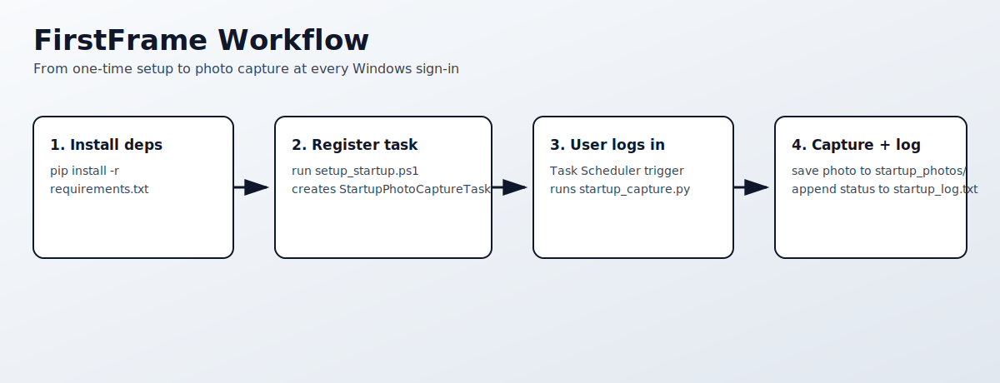
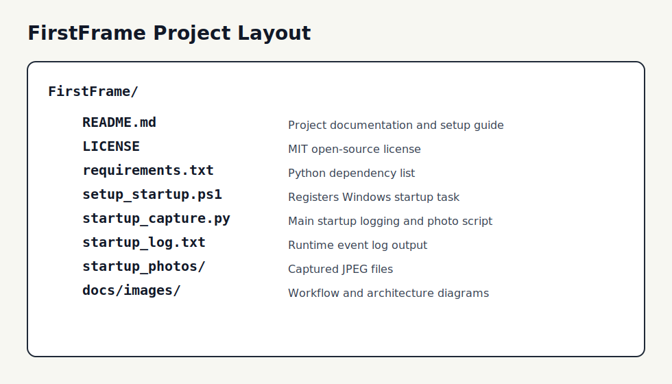

# FirstFrame

`FirstFrame` is a lightweight Windows automation project that captures one webcam photo each time you sign in.

It uses Task Scheduler to run `startup_capture.py` at logon, then:
- Logs startup timestamp in `startup_log.txt`
- Captures one webcam frame
- Saves the photo to `startup_photos/` as `YYYY-MM-DD_HH-MM-SS.jpg`



## Project Structure



## Requirements

- Windows 10 or newer
- Python 3.10+ (with `python` available in PATH)
- Webcam connected and accessible

## Setup

1. Clone the repository and open PowerShell in the project root.
2. Install dependencies:

```powershell
python -m pip install -r requirements.txt
```

3. Register the startup task:

```powershell
Set-ExecutionPolicy -Scope Process Bypass
.\setup_startup.ps1
```

This creates or updates a scheduled task named `StartupPhotoCaptureTask` for the current user.

## Run Manually (Quick Test)

Run once to verify your camera and paths:

```powershell
python .\startup_capture.py
```

Expected outputs:
- A new line in `startup_log.txt`
- A new `.jpg` file in `startup_photos/`

## Verify Startup Automation

1. Sign out and sign back in.
2. Confirm `startup_log.txt` contains a fresh `STARTED:` entry.
3. Confirm `startup_photos/` includes a new image with current timestamp.

## Uninstall / Disable

Remove the scheduled task:

```powershell
Unregister-ScheduledTask -TaskName "StartupPhotoCaptureTask" -Confirm:$false
```

## Troubleshooting

- `PHOTO_ERROR: opencv-python is not installed`
	- Reinstall dependencies: `python -m pip install -r requirements.txt`
- `PHOTO_ERROR: Camera not available`
	- Close other apps using the camera and re-run script
	- Check Windows camera privacy settings
- `Python is not installed or not in PATH`
	- Install Python and ensure `python` command works in PowerShell

## Security and Privacy

- This project captures images from your local webcam at user sign-in.
- Use it only on systems where all users are informed and where this behavior complies with policy/law.

## License

This project is licensed under the MIT License. See `LICENSE`.
